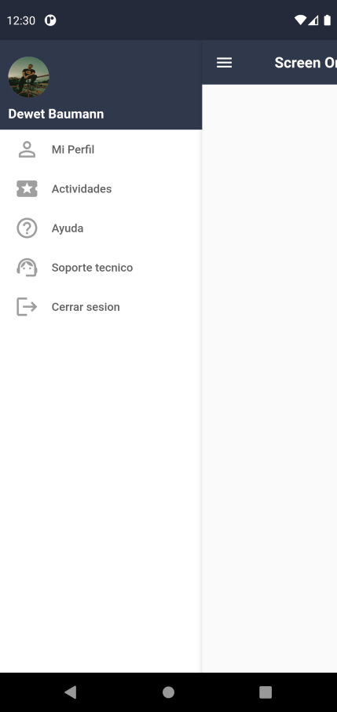

# Sidebar en Flutter

Muestra de un pequeño ```sidebar``` realizado en Flutter, el cual es completamente intercactivo para crearlo solamente hice uso del widget 
+ ```AnimatedPositioned```
+  ```Stack```

Los cuales nos permiten redibujar un widget en otra parte y/o sobre ponerlos, dentro del sidebar tenermos ```5 botones``` los cuales estan completamente listos para agregar funcionalidades y empezar a usar


